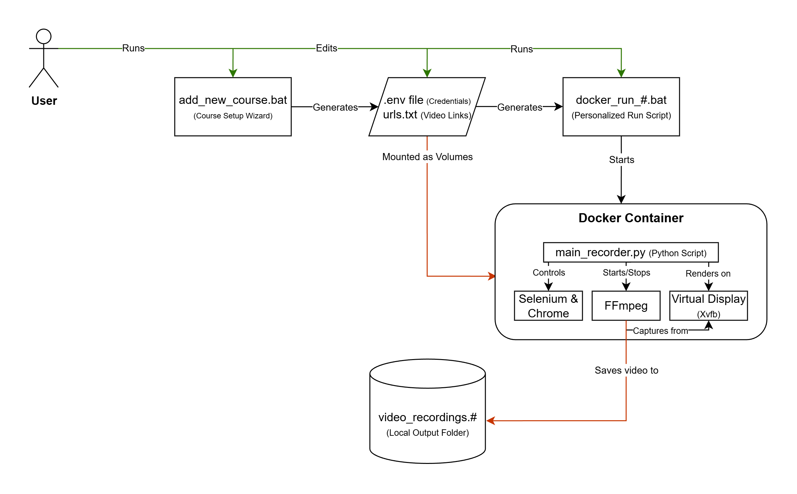

# Docker Course Recorder

## Project Overview

This project is a Python-based automated video recording system deployed using Docker and Docker Compose.

It automates interaction with web-based learning platforms, records video content, and ensures reliable execution in an isolated environment.



---

## System Workflow

1. **Input**

The system reads:

- User credentials from a `.env` file  
- A list of video URLs from `urls.txt`  

---

2. **Environment Setup**

- The application runs inside a Docker container  
- Chrome browser is launched using Selenium  
- Display and audio are configured for screen recording  

---

3. **Authentication**

- The program opens the login page  
- Enters user credentials  
- Authenticates into the platform  

---

4. **Video Processing**

For each video:

- Opens the video page  
- Adjusts playback speed  
- Sets the highest available quality (up to 1080p)  
- Switches to fullscreen mode  
- Starts playback  
- Detects video duration  
- Records the video for its full duration  
- Proceeds to the next video  

---

5. **Recording**

- Recording is handled using FFmpeg  
- Captures both screen and audio  

---

6. **Output**

- Videos are saved locally
- Files are named automatically
- The system logs successful and failed recordings

---

## Demo

This project supports a test mode for demonstration purposes, allowing the system to run without recording full-length videos.

Example configuration:

```python
TEST_MODE = True
TEST_DURATION_SECONDS = 15
```

A short demonstration of the project can be viewed here:  
https://youtu.be/_969x99kUOw

## Usage

### 1. Requirements

- Docker Desktop (installed and running)
  https://www.docker.com/products/docker-desktop/

---

### 2. Initial Setup (one-time)

1. Build the Docker image  
   - Run `docker_build.bat`  
   - Wait for the build process to complete  

---

### 3. Adding and Running a Course

#### 3.1 Add a new course

1. Run the setup script  
   - Execute `add_new_course.bat`  

2. Provide the required information:  
   - Course name (e.g. `ai`, `python`, `java`)  
   - Login credentials  
   - Video URLs (type `done` when finished)  

3. The script will automatically create:  
   - Configuration folder (e.g. `config_course_ai/`)  
   - Output folder (e.g. `video_recordings_ai/`)  
   - Run script (e.g. `docker_run_ai.bat`)  

To add another course, run the script again.

---

#### 3.2 Start recording

- Run the generated script (e.g. `docker_run_ai.bat`)  
- The recording process will start automatically  

Recorded videos will appear in the corresponding output folder.

---

### 4. Debugging (optional)

If you want to monitor the process in real time, you can enable VNC access.

1. Install VNC Viewer  
   https://www.realvnc.com/en/connect/download/viewer/

2. Edit the run script (e.g. `docker_run_ai.bat`)  

Add this line after `docker run`:

```bash
-p 5900:5900
```

Example:

docker run --rm -it ^
  -p 5900:5900 ^
  -v "%cd%\config_course_ai\.env:/app/.env" ^
…
```

3. Run the modified script

4. Open VNC Viewer and connect to: localhost:5900
You will see the container environment in real time.

*(If running multiple sessions, use different ports (e.g. 5901, 5902).)*